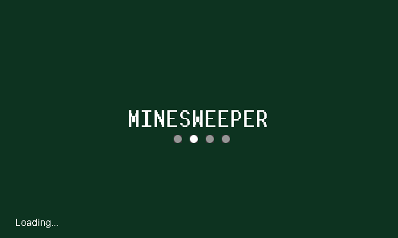
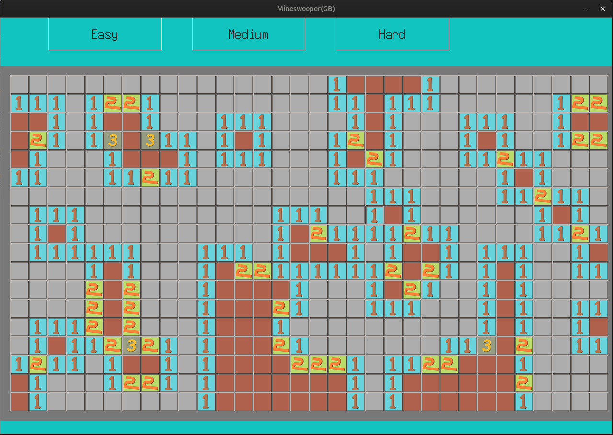
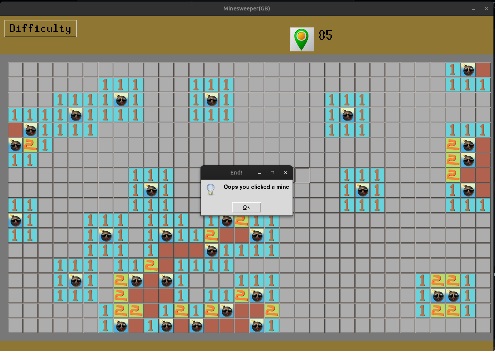

# Minesweeper GUI — Classic Game!

Helloooooo!  
This is my version of good old **Minesweeper** game — built entirely with Python using `tkinter` for GUI.

---

## What’s Inside?

- A fully working **Minesweeper** with a graphical interface
- Classic mechanics: click to reveal, right-click to flag
- Recursive clearing of empty tiles (like the real game!)
- All built using **standard Python** — no **fancy** dependencies

---

## Gameplay Previews


<br/>

<br/>

<br/>
---

## For Getting Started

### Requirements

Just Python!  
No need to install anything extra. Just Python.....

### To Run it:

```bash
git clone https://github.com/GaganBhusal/Minesweeper_GUI.git
cd Minesweeper_GUI
python minesweeper_new.py
